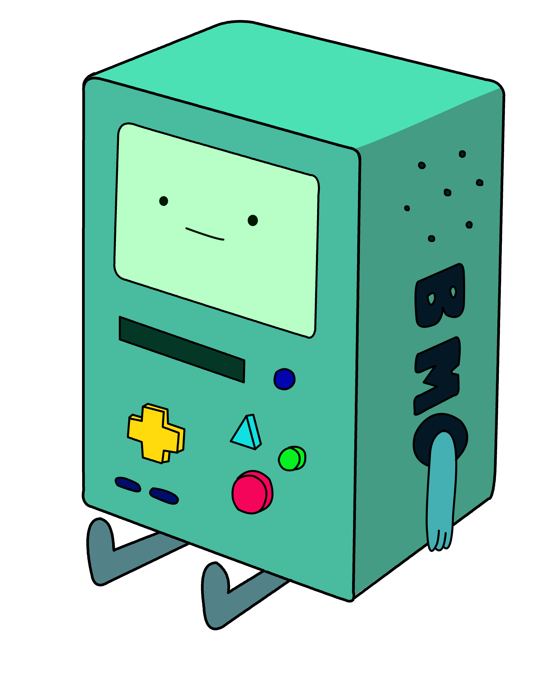

# Captive Shells



---

# What is a Captive Shell?

* What is a Captive Portal?

---

# Use cases

* SSH Bastion or Jump Box
* Point-of-Sale systems, (e.g. Lowe’s)
* Limiting a user’s commands (list of linux commands to pwn)
** Did you know you could yum exec
---

# Alternatives

* lbash
* rbash

# Demo breakout
```terminal8
bash -il
```
---

# Inspiration - Why

## https://bmo.dev/
* Turtles all the way down picture
* Prometheus node_exporter


---

# Considerations

## Less is more

* I don’t want to ship all of bash
* Who remember’s ShellShock?
```bash
env x='() { :;}; echo Vulnerable' bash -c "echo Not Vulnerable to ShellShock"
```

---

# Considerations

## Interpreted languages

```bash
$ strace -fvT -e trace=execve ./foo.pl
```

---

# Considerations

## Signals

```file
path: script/captive-camel.pl
lang: perl
lines:
  start: 0
  end: 10
```
---

# Hack the Gibson

```terminal8
bash -il
```

---

```qrcode-ex
columns:
    - data: https://bmo.dev/
      caption: "https://bmo.dev/blog/captive-shells"
    - data: https://github.com/bmodotdev/captive-camel
      caption: "https://github.com/bmodotdev/captive-camel"
```
